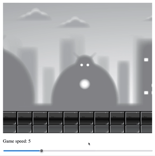

# Game Development Projects

Collection of smaller projects for game development with plain JavaScript. Mostly inspired by freecodecamp's [JavaScript Game Development Course for Beginners](https://www.youtube.com/watch?v=GFO_txvwK_c).

Currently contains the following projects:

## Sprite Animations 

Shows different animations from a spritesheet on canvas. Includes code for reading values from a dropdown menu, precompute spritesheet positions and a function for sprite animation. All necessary code is found in `sprite_animations`. 

## Parallax backgrounds

Displays multiple background layers and moves them at various speeds to create an illusion of depth. Includes code for a class that holds each background layer and functionality for updating image positions as well as drawing on canvas. Code is found in `parallax_backgrounds`. 

